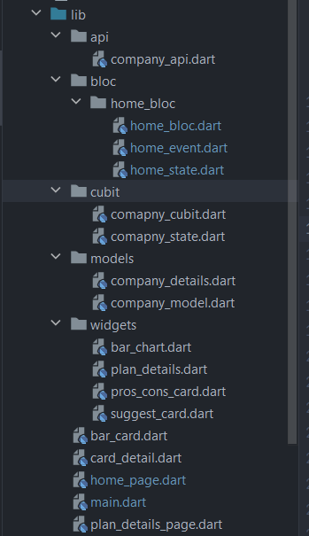
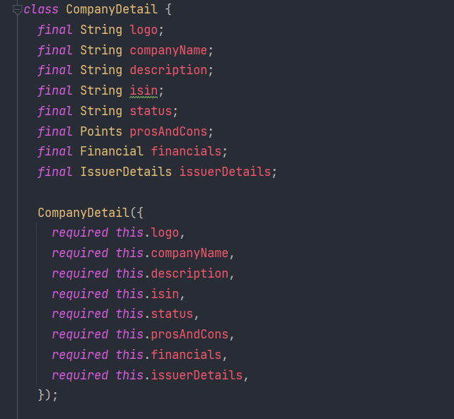
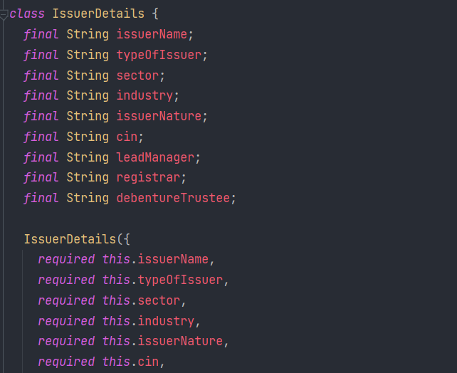

# Investment App
- A platform which helps the customers who want to invest in comapany investment plans. it provides Investment plan details by  showcasing list of the compnies which are currently open for the investments with real time data updates by animated UI/UX.
- Its Uses Bloc,Cubit for state management

## Tech Stack
-   **Frontend:** Flutter, Bloc, Cubit,fl_charts,intl
-   **Events:** User interactions or external triggers.
-   **Cubit/Bloc:** Handles business logic and state changes.
-   **States:** Represents the current UI state.

## Installation

Installation of the Project

```bash
  git clone https://github.com/Kotresh162/Investment_App.git
  cd Investment_App
```

```bash
  flutter pub get
  flutter fub run
```

## Installation
How to run the app in Physical Device
```bash
  flutter build apk --release
```
go to the file location
build\app\outputs\flutter-apk\app-release.apk ->>this is the apk file

## Screenshots
### Project Strusture


Company Detail model

Insurence model



## Badges

Add badges from somewhere like: [shields.io](https://shields.io/)

[](https://choosealicense.com/licenses/mit/)
[](https://opensource.org/licenses/)
[](http://www.gnu.org/licenses/agpl-3.0)


## Demo
Insert gif or link to demo


